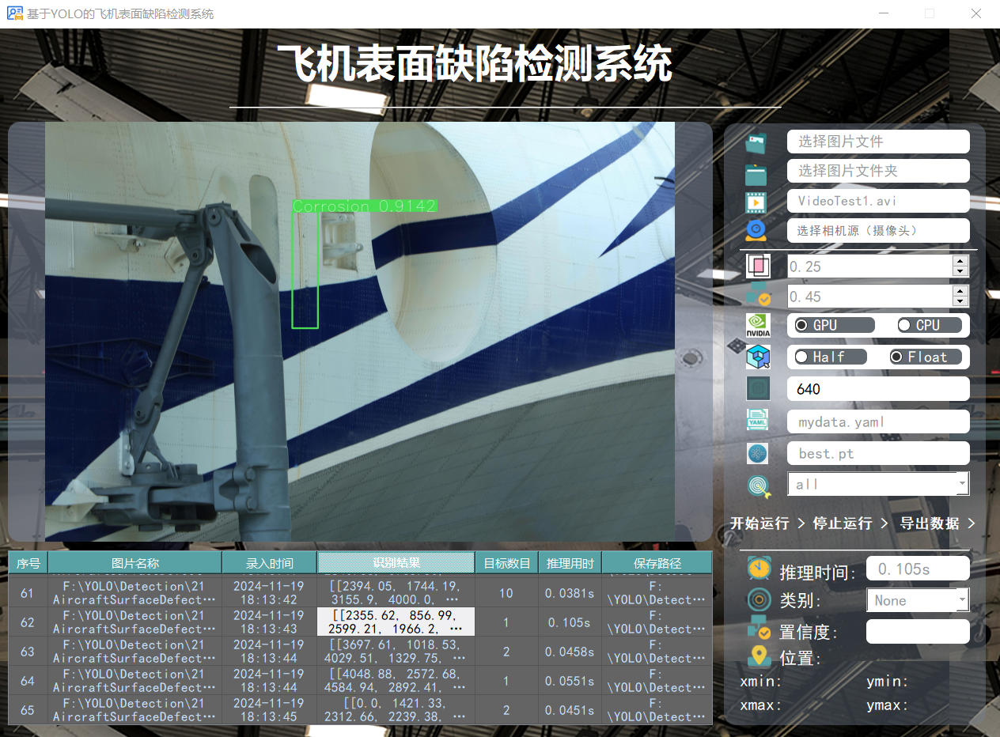

# 基于YOLO的飞机表面缺陷检测系统

## 项目介绍
可参考                
[【YOLO 系列】基于YOLO的飞机表面缺陷智能检测系统【python源码+Pyqt5界面+数据集+训练代码】](https://mp.weixin.qq.com/s/GQ-YviLAiPObbHDb6FmpOA)	

## 项目目录
```
| --
    --icon
    --img
    --output
    --runs
    --UI
    --VOCData
        -- splitDataset.py
        -- ViewCategory.py
        -- xml2txt.py
    --weights
    --detect.py
    --GUI.py
    --README.md
    --requirements.txt
    --train.py
```

## 模型训练
### 数据集格式
通过网盘分享的文件：AircraftSurfaceDefect Dataset
链接: https://pan.baidu.com/s/1pCpwxMeo3E0cG4JXpyC7lw 提取码: vv2s

1. 将解压的数据集放在 VOCDataset 文件夹里面； 
2. 运行splitDataset.py，用于划分数据集；
3. 运行xml2txt.py，用于得到训练标注文件；
4. 运行ViewCategory.py，用于查看一共有那些类别；
5. mydata.yaml，用于填写模型训练的数据配置文件。
注意：在xml2txt.py和mydata.yaml中的类别名称的顺序要一致。 

### 训练
```
python train.py
```

## 模型推理

```
python detect.py
```

## 可视化界面
```
python GUI.py
```

# 联系作者
WX公众号：@AI算法与电子竞赛

## 项目相关问题
问题：运行GUI.py，且填写相关内容从后，依然推理失败    
解决：请查看下述图片，【imgs：640；yaml：选VOCDaata里面的；weights：选runs里面的，GPU不行就选CPU】


问题：数据集在哪里       
解决：提供了下载链接，进行下载，如果出现任何问题，就请换一个解压软件。【推荐（bandizip）】

问题：数据集处理不来，有问题      
解决：该问题自行解决，在上述给出了流程的

问题：如何修改UI文件里面的字体和内容     
解决：在你的环境里面找到designer.exe。用该软件打开UI文件，进行修改

问题：摄像头如何使用
解决：摄像头图标右边可以输出，再这里输入0或视频流地址，然后点击摄像头图片，最后再点击开始运行